# Retail & Marketing Analytics — Customer Segmentation & Retention

## Executive Summary

Customer acquisition costs have risen dramatically across e-commerce, making retention and lifetime value maximization critical. This project analyzes **541,909 real transactions** from a UK-based online gift retailer (Dec 2010 – Dec 2011) to build a data-driven customer segmentation system using **RFM analysis**, **K-Means clustering**, and **cohort retention analysis**.

> **Bottom line:** 11.3% of customers (Champions) generate 49.8% of total revenue. Meanwhile, 30.5% of customers (At Risk + Can't Lose Them) represent £1.4M in revenue at risk. A targeted retention strategy could recover £37,500+ in at-risk revenue and improve Month-1 retention from 20.6% to 35%.

---

## Key Findings

| # | Finding | Detail |
|---|---------|--------|
| 1 | **Revenue follows the Pareto principle** | Top 20% of customers generate ~74% of total revenue |
| 2 | **Month-1 retention is only 20.6%** | ~80% of first-time buyers never return — massive onboarding gap |
| 3 | **£1.4M revenue at risk** | 1,324 customers in At Risk + Can't Lose Them segments |
| 4 | **K-Means validates RFM segments** | Cluster profiles align with rule-based segments (Champions cluster has avg monetary £12,822) |
| 5 | **UK dominates but non-UK markets have higher per-customer value** | Netherlands, Australia, Japan show higher revenue per customer |

---

## Exploratory Data Analysis (EDA)

### RFM Distributions
Recency, Frequency, and Monetary values are all heavily right-skewed — most customers have low recency (recent), low frequency (1-2 orders), and low spend. The right tail represents high-value Champions.

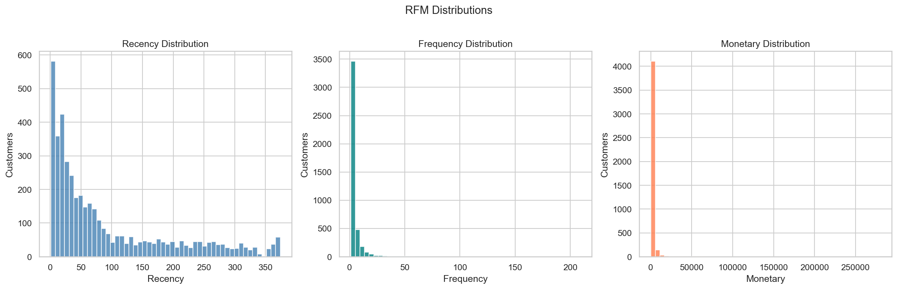

### Order Frequency Distribution
34.4% of customers made exactly one purchase. Understanding this one-time buyer cohort is critical for improving Month-1 retention.

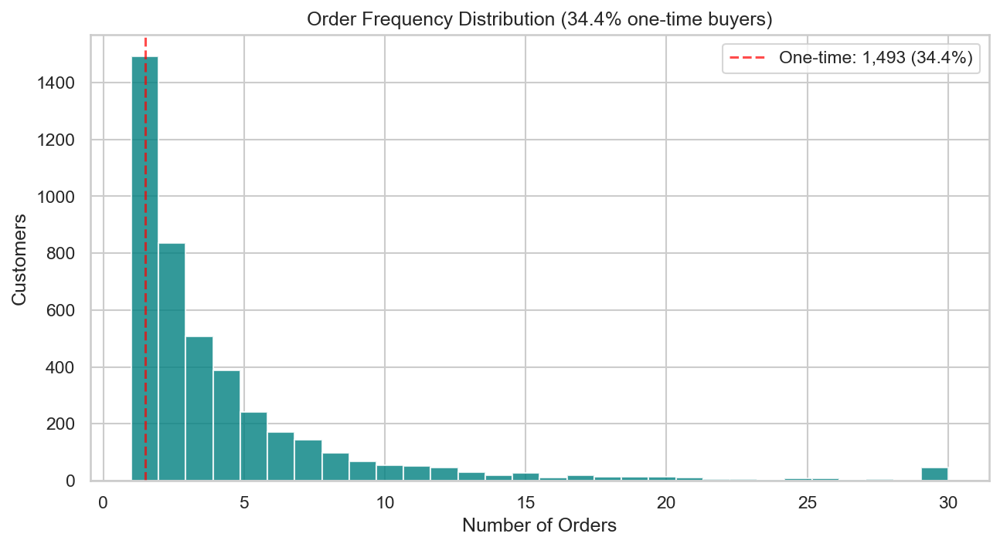

### Revenue Concentration (Pareto Curve)
Revenue is highly concentrated — the top 20% of customers account for approximately 74% of total revenue, closely matching the classic Pareto principle.

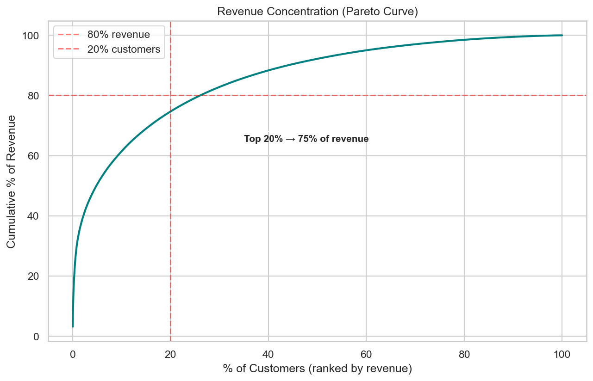

### Monthly Revenue Trend
Revenue shows clear seasonality with a dramatic spike in Nov–Dec 2011 (holiday gifting season), consistent with PRD Hypothesis H6.

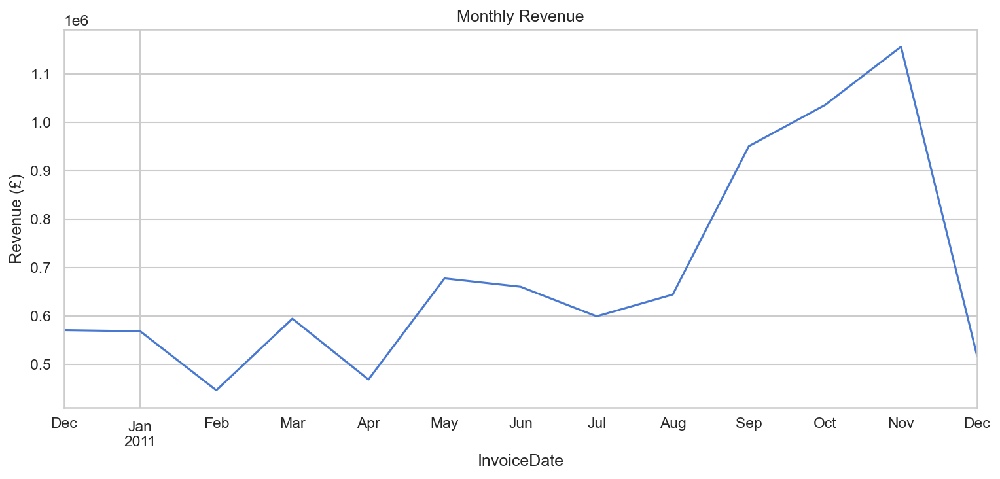

### Revenue by Country
The UK dominates with ~91% of customers, but non-UK European markets (Netherlands, EIRE, Germany, France) contribute meaningful revenue.

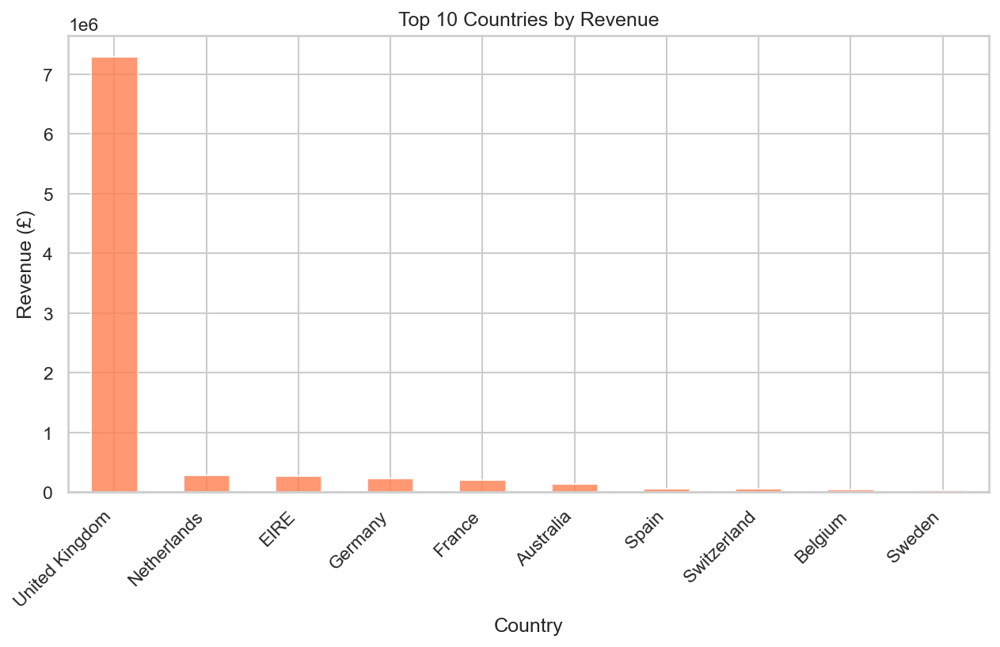

### Revenue per Customer by Country
When controlling for customer count, markets like Netherlands, Australia, and Japan show significantly higher per-customer value — these are likely wholesale buyers placing larger orders.

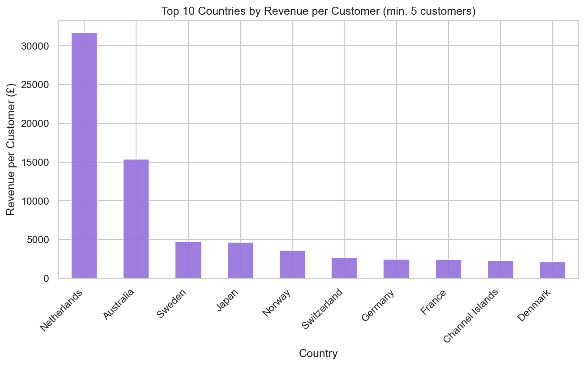

### Purchase Timing Patterns
Transactions peak mid-week (Tuesday–Thursday) and during business hours (10am–3pm), suggesting the customer base is primarily B2B/wholesale buyers rather than consumer shoppers.

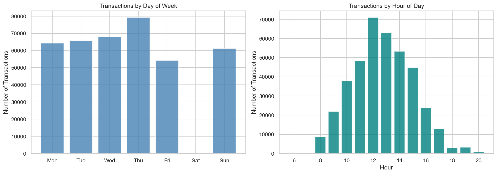

### Top Products
Revenue is driven by high-volume items (PAPER CRAFT, MEDIUM CERAMIC JAR) rather than premium products, indicating a volume-based business model.

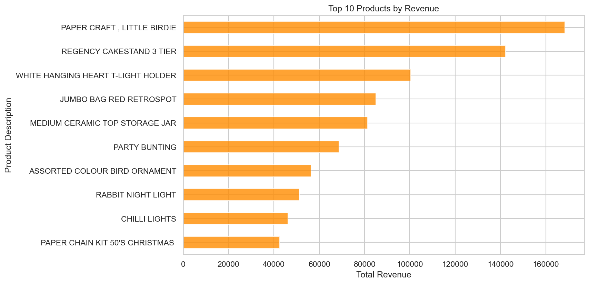

---

## Customer Segmentation

### Segment Distribution
8 behavioral segments were created using RFM rule-based logic matching the PRD definitions. Loyal Customers (23.8%) and Lost/Hibernating (16.6%) are the two largest segments.

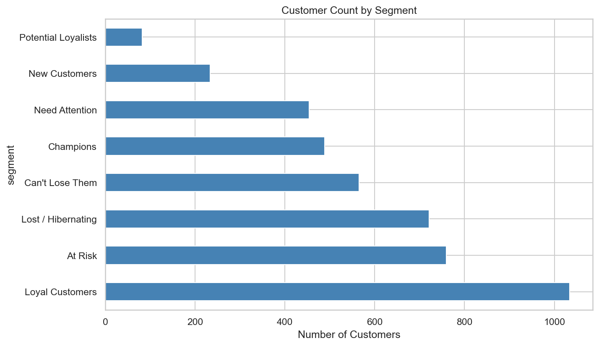

### Revenue by Segment
Champions dominate revenue contribution at 49.8% despite being only 11.3% of customers. Lost/Hibernating customers contribute just 2.1%.

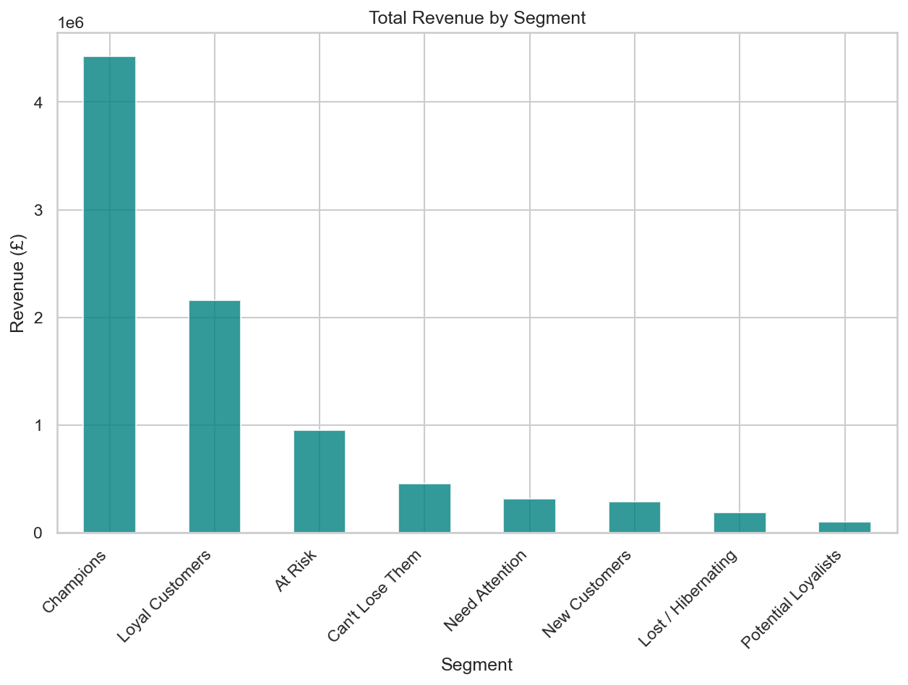

### Segment Profile Summary

| Segment | Customers | % of Total | Avg Recency | Avg Frequency | Avg Monetary | Revenue Share |
|---------|-----------|-----------|-------------|---------------|--------------|---------------|
| Champions | 489 | 11.3% | 7 days | 15.5 orders | £9,048 | 49.8% |
| Loyal Customers | 1,034 | 23.8% | 23 days | 5.2 orders | £2,089 | 24.3% |
| At Risk | 759 | 17.5% | 84 days | 3.3 orders | £1,255 | 10.7% |
| Can't Lose Them | 565 | 13.0% | 232 days | 2.2 orders | £805 | 5.1% |
| Need Attention | 454 | 10.5% | 62 days | 1.2 orders | £695 | 3.6% |
| New Customers | 234 | 5.4% | 10 days | 1.6 orders | £1,226 | 3.2% |
| Lost / Hibernating | 721 | 16.6% | 202 days | 1.0 orders | £262 | 2.1% |
| Potential Loyalists | 82 | 1.9% | 34 days | 1.7 orders | £1,267 | 1.2% |

### Segment Scatter Plot
Frequency vs Monetary bubble chart shows Champions and Loyal Customers clearly separated from the rest of the base.

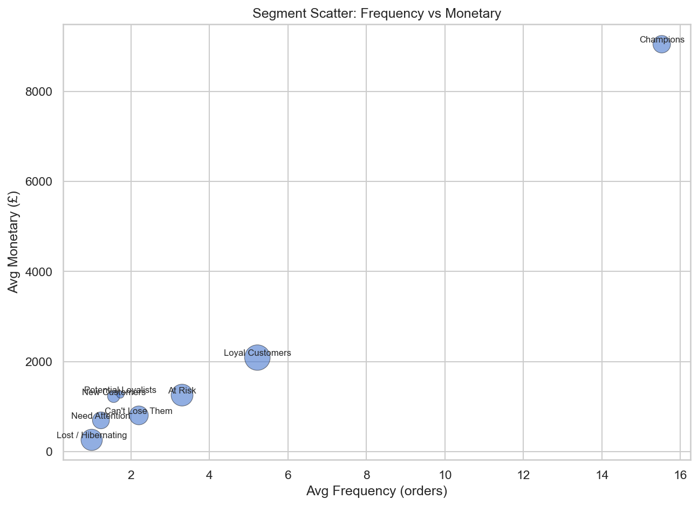

---

## K-Means Clustering (ML Validation)

### Elbow Method & Silhouette Score
K=2 has the highest silhouette score (0.433), but K=4–5 provides more actionable granularity for business use. K=5 was chosen to balance interpretability with cluster distinction.

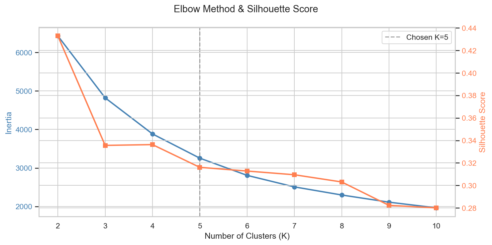

### RFM Segments vs K-Means Clusters
The cross-tabulation confirms strong alignment between rule-based segments and data-driven clusters — Champions map cleanly to Cluster 4, Lost/Hibernating to Cluster 2.

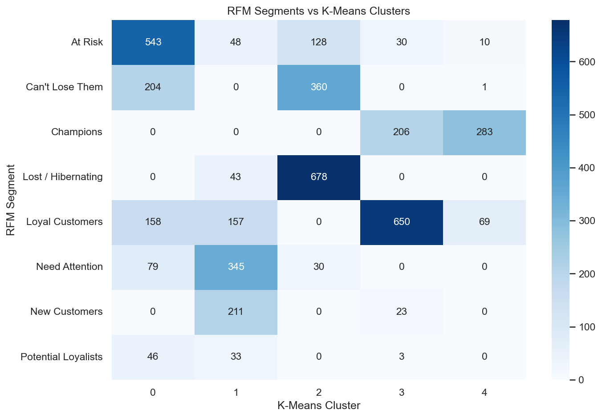

---

## Cohort Retention Analysis

### Retention Heatmap
Month-0 is always 100% by definition. The steepest drop occurs at Month-1 (avg 20.6%), confirming the critical onboarding gap.

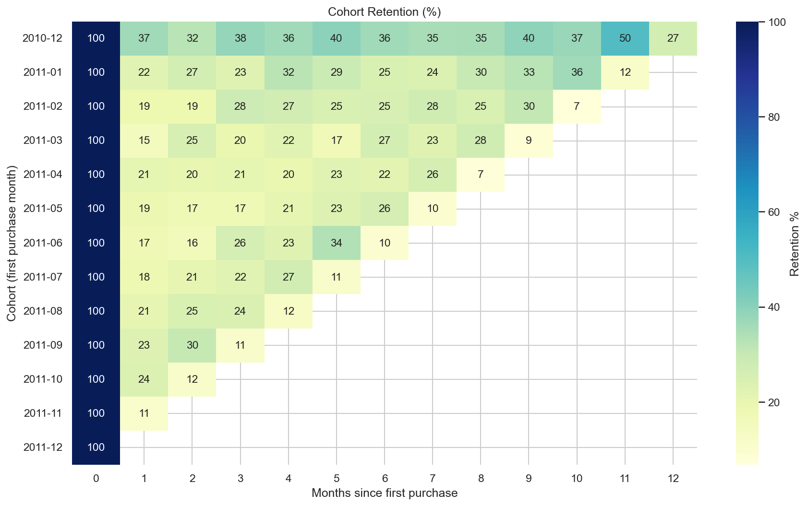

### Retention Curves
The top 3 cohorts show that retention stabilizes around Month-3 to Month-6, suggesting that customers who survive the first 3 months become loyal long-term buyers.

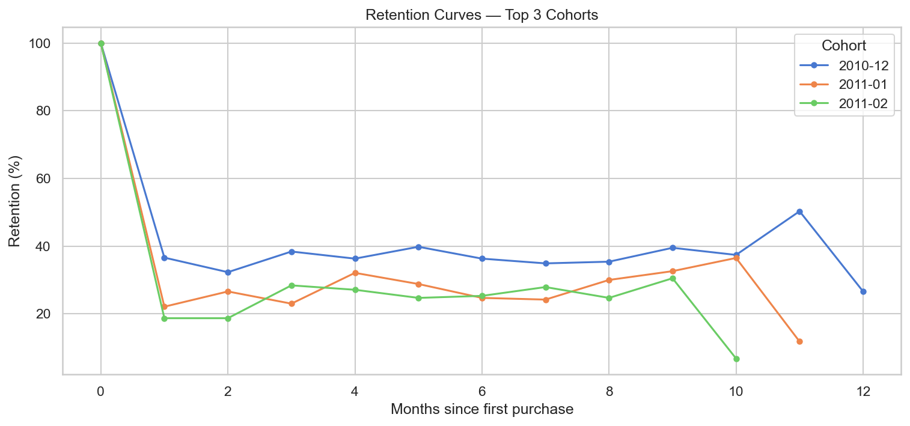

### Key Retention KPIs

| Metric | Value | Interpretation |
|--------|-------|----------------|
| Month-1 Retention | 20.6% | ~80% of first-time buyers never return |
| Month-3 Retention | 23.2% | Remaining customers show stickiness |
| Month-6 Retention | 24.4% | Core loyal base stabilizes |
| Month-12 Retention | 26.6% | Long-term retained foundation |

---

## Business Recommendations

| # | Segment | Strategy | Tactics | Estimated Impact |
|---|---------|----------|---------|------------------|
| 1 | **Champions** | Protect & Reward | VIP loyalty program, early access, referral incentives | Increase LTV by 15–20% |
| 2 | **Loyal Customers** | Grow & Upsell | Cross-sell, bundle offers, free shipping thresholds | Boost AOV by 10–15% |
| 3 | **New Customers** | Onboard & Engage | Welcome email series (Day 1/7/14/30), first-repeat discount | Improve Month-1 retention from 20.6% → 35% |
| 4 | **At Risk** | Win Back | "We miss you" campaign, personalized offers, time-limited discounts | Reactivate 10–15% of segment |
| 5 | **Can't Lose Them** | Urgent Outreach | Personal outreach, exclusive "come back" offers, departure surveys | Recover 5–10% of highest-value churners |
| 6 | **Lost / Hibernating** | Low-Cost Reactivation | Automated email blast, deprioritize paid spend, reallocate budget | Save marketing budget for higher-ROI segments |

### Estimated Financial Impact

```
REVENUE AT RISK (At-Risk + Can't Lose Them):
  1,324 customers | £1,407,925 in historical revenue
  If 15% reactivated @ avg £250 spend:
  → 199 customers × £250 = £49,625 recovered revenue

MONTH-1 RETENTION IMPROVEMENT:
  ~234 new customers acquired in observation period
  Current Month-1 retention: 20.6% → ~48 return
  If improved to 35% → ~82 return
  → 34 additional retained × £1,226 avg value = £41,684

TOTAL ESTIMATED ANNUAL IMPACT:
  Conservative: £50,000–£75,000 incremental revenue
  + Improved marketing efficiency from budget reallocation
```

---

## Project Structure

```
customer-segmentation-retention-analytics/
│
├── README.md
├── requirements.txt
├── .gitignore
│
├── data/
│   ├── raw/                    # Online Retail.xlsx (place here)
│   ├── preprocessed/           # online_retail_preprocessed.csv
│   └── featured/               # customer_rfm.csv, cohort_retention.csv,
│                               # customer_rfm_clusters.csv, segment_profiles.csv,
│                               # elbow_silhouette.csv
│
├── notebooks/
│   ├── 01_data_exploration.ipynb   # EDA, missing values, revenue by country
│   ├── 02_data_cleaning.ipynb      # Cleaning pipeline
│   ├── 03_rfm_analysis.ipynb       # RFM computation and segment assignment
│   ├── 04_clustering.ipynb         # K-Means, elbow/silhouette, RFM vs clusters
│   ├── 05_cohort_analysis.ipynb    # Cohort retention heatmap
│   └── 06_insights_strategy.ipynb  # Pareto, revenue at risk, strategies
│
├── src/
│   ├── __init__.py
│   ├── data_cleaning.py         # Load Excel, remove cancellations/null IDs, add Revenue/YearMonth
│   ├── rfm_analysis.py          # Recency, Frequency, Monetary; quartile scoring; segments
│   ├── cohort_analysis.py       # Cohort and retention heatmap data
│   ├── clustering.py            # K-Means on log-scaled RFM with elbow/silhouette
│   ├── run_data_pipeline.py     # Run cleaning → RFM → cohort → clustering
│   └── visualizations.py        # 16 chart types for segments, retention, products, etc.
│
├── sql/
│   ├── 01_data_profiling.sql    # SQL profiling queries
│   └── 02_rfm.sql               # Full RFM segmentation in SQL
│
├── tests/
│   └── test_cleaning.py         # Unit tests for data cleaning
│
└── images/
    ├── eda_charts/              # Generated EDA and analysis charts (16 PNGs)
    └── tableau/                 # Tableau dashboard screenshots
```

---

## Tools & Technologies

| Category | Tools |
|----------|-------|
| **Languages** | Python, SQL |
| **Data Analysis** | Pandas, NumPy, SciPy |
| **Machine Learning** | Scikit-learn (K-Means, StandardScaler, Silhouette Score) |
| **Visualization** | Matplotlib, Seaborn |
| **Database** | SQLite (optional, for SQL profiling) |
| **Environment** | Jupyter Lab |

---

## How to Run This Project

### 1. Clone the Repository

```bash
git clone https://github.com/nirajmehta960/customer-segmentation-retention-analytics.git
cd customer-segmentation-retention-analytics
```

### 2. Set Up a Virtual Environment (Recommended)

```bash
python3 -m venv venv
source venv/bin/activate   # Windows: venv\Scripts\activate
```

### 3. Install Dependencies

```bash
pip install -r requirements.txt
```

### 4. Download the Data

1. Download the dataset from the [UCI Machine Learning Repository](https://archive.ics.uci.edu/dataset/352/online+retail) or [Kaggle](https://www.kaggle.com/datasets/mashlyn/online-retail-ii-uci).
2. Place the raw file as `data/raw/Online Retail.xlsx`.

### 5. Run the Analysis

**Option A: Full pipeline (recommended)**

From the project root:

```bash
python src/run_data_pipeline.py
```

This runs: cleaning → preprocessed CSV → RFM → segment profiles → cohort retention → elbow/silhouette → K-Means clusters.

**Option B: Run step-by-step**

- Cleaning only: `python src/data_cleaning.py`
- RFM only (after cleaning): `python src/rfm_analysis.py`
- Cohort only: `python src/cohort_analysis.py`
- Clustering only (after RFM): `python src/clustering.py`

**Option C: Run via Jupyter Notebooks**

```bash
jupyter lab
```

Run in order: `01_data_exploration.ipynb` → `02_data_cleaning.ipynb` → `03_rfm_analysis.ipynb` → `04_clustering.ipynb` → `05_cohort_analysis.ipynb` → `06_insights_strategy.ipynb`.

### 6. Run Tests

```bash
python -m pytest tests/ -v
```

---

## Methodology Summary

- **RFM:** Recency (days since last purchase), Frequency (distinct orders), Monetary (total revenue). Quartile scores 1–4; Recency inverted (recent = 4). Rule-based segments: Champions, Loyal Customers, New Customers, Potential Loyalists, At Risk, Can't Lose Them, Lost / Hibernating, Need Attention.
- **K-Means:** log1p(RFM), StandardScaler, monetary capped at 99th percentile (£19,780) to limit outlier influence. K chosen via elbow/silhouette (K=5); used to validate and compare to rule-based segments.
- **Cohort:** Cohort = first purchase month; retention % = (customers active in month N) / (cohort size) × 100.

---

## Data Source

**UCI Machine Learning Repository — Online Retail**

- ~541,000 transaction line items | 8 columns | 38 countries | Dec 2010 – Dec 2011
- [Dataset Link](https://archive.ics.uci.edu/dataset/352/online+retail)
- Also on [Kaggle](https://www.kaggle.com/datasets/mashlyn/online-retail-ii-uci)
- License: CC BY 4.0
- Original paper: Chen, D., Sain, S.L., Guo, K. (2012). "Data mining for the online retail industry: A case study of RFM model-based customer segmentation using data mining." *Journal of Database Marketing and Customer Strategy Management*, Vol. 19, No. 3, pp. 197–208.

---

## References

- Project Report: `Retail & Marketing Analytics Project Report — End-to-End.pdf` (BRD + PRD in repo).
- Chen, D., Sain, S.L., Guo, K. (2012). "Data mining for the online retail industry." *JDMCSM*, Vol. 19, No. 3, pp. 197–208.
- UCI: https://archive.ics.uci.edu/dataset/352/online+retail
